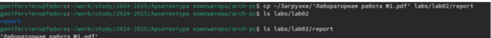

---
## Front matter
title: "Лабораторная работа №2"
subtitle: "Система контроля версий Git"
author: "Виеру Женифер"

## Generic otions
lang: ru-RU
toc-title: "Содержание"

## Bibliography
bibliography: bib/cite.bib
csl: pandoc/csl/gost-r-7-0-5-2008-numeric.csl

## Pdf output format
toc: true # Table of contents
toc-depth: 2
fontsize: 12pt
linestretch: 1.5
papersize: a4
documentclass: scrreprt
## I18n polyglossia
polyglossia-lang:
  name: russian
  options:
	- spelling=modern
	- babelshorthands=true
polyglossia-otherlangs:
  name: english
## I18n babel
babel-lang: russian
babel-otherlangs: english
## Fonts
mainfont: IBM Plex Serif
romanfont: IBM Plex Serif
sansfont: IBM Plex Sans
monofont: IBM Plex Mono
mathfont: STIX Two Math
mainfontoptions: Ligatures=Common,Ligatures=TeX,Scale=0.94
romanfontoptions: Ligatures=Common,Ligatures=TeX,Scale=0.94
sansfontoptions: Ligatures=Common,Ligatures=TeX,Scale=MatchLowercase,Scale=0.94
monofontoptions: Scale=MatchLowercase,Scale=0.94,FakeStretch=0.9
mathfontoptions:
## Biblatex
biblatex: true
biblio-style: "gost-numeric"
biblatexoptions:
  - parentracker=true
  - backend=biber
  - hyperref=auto
  - language=auto
  - autolang=other*
  - citestyle=gost-numeric
## Pandoc-crossref LaTeX customization
figureTitle: "Рис."
tableTitle: "Таблица"
listingTitle: "Листинг"
## Misc options
indent: true
header-includes:
  - \usepackage{indentfirst}
  - \usepackage{float} # keep figures where there are in the text
  - \floatplacement{figure}{H} # keep figures where there are in the text
---

# Цель работы

Целью работы является изучить идеологию и применение средств контроля версий. Приобрести практические навыки по работе с системой git.

# Выполнение лабораторной работы
Сначала сделаем предварительную конфигурацию git  (рис. [-@fig:001]).

{#fig:001 width=70%}

Настроим utf-8 в выводе сообщений git (рис. [-@fig:002]).

{#fig:002 width=70%}

Зададим имя начальной ветки (будем называть её master) (рис. [-@fig:003]).

{#fig:003 width=70%}

Параметр autocrlf и параметр safecrlf (рис. [-@fig:004]).

{#fig:004 width=70%}

(рис. [-@fig:005]).

{#fig:005 width=70%}

Ключи сохраняться в каталоге ~/.ssh/. (рис. [-@fig:006]).

{#fig:006 width=70%}

Для этого зайти на сайт http: //github.org/ под своей учётной записью и перейти в меню . После этого выбрать в боковом меню SSH and GPG keys и нажать кнопку . Скопировав из локальной консоли ключ в буфер обмена (рис. [-@fig:007]).

{#fig:007 width=70%}

Далее создаем каталог для предмета «Архитектура компьютера» (рис. [-@fig:008]).

{#fig:008 width=70%}

Далее создаем репозитория курса (рис. [-@fig:009]).

{#fig:009 width=70%}

Перейдем в каталог курса (рис. [-@fig:010]).

{#fig:010 width=70%}

Далее копируем созданный репозиторий(рис. [-@fig:011]).

{#fig:011 width=70%}

Далее перейдем в каталог, удалим лишние файлы  (рис. [-@fig:012]).

{#fig:012 width=70%}

Далее создаем необходимые каталоги (рис. [-@fig:013]).

{#fig:013 width=70%}

Далее отправляем файлы на сервере (рис. [-@fig:014]).

{#fig:014 width=70%}

Проверим правильность создания иерархии рабочего пространства в локальном репозитории (рис. [-@fig:015]).

{#fig:015 width=70%}

Проверим правильность создания иерархии рабочего пространства на странице github (рис. [-@fig:016]).

{#fig:016 width=70%}

Далее выполним задания для самостоятельной работе. Сначало создаем отчет по выполнению лабораторной работ(рис. [-@fig:017]).

{#fig:017 width=70%}

Далее скопируем отчеты по выполнению предыдущих лабораторных работ в соответствующие каталоги созданного рабочего пространства. (рис. [-@fig:018]).

{#fig:018 width=70%}

Далее загрузим все файлы на github (рис. [-@fig:019]).

{#fig:019 width=70%}

# Выводы
Выполнив данную лабораторную работу я обрела теоретические и практические знания в использовании Linux и github. При помощи консоли я научилась проводить стандартные процедуры при наличии центрального репозитория, настраивать github, создания SSH ключа, сохранение и отправка изменений на локальном репозитории.
