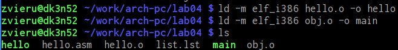
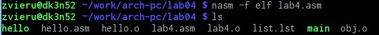

---
## Front matter
title: "Лабораторная работа №4"
subtitle: "Создание и процесс
обработки программ на языке ассемблера NASM"
author: "Виеру Женифер"

## Generic otions
lang: ru-RU
toc-title: "Содержание"

## Bibliography
bibliography: bib/cite.bib
csl: pandoc/csl/gost-r-7-0-5-2008-numeric.csl

## Pdf output format
toc: true # Table of contents
toc-depth: 2
fontsize: 12pt
linestretch: 1.5
papersize: a4
documentclass: scrreprt
## I18n polyglossia
polyglossia-lang:
  name: russian
  options:
	- spelling=modern
	- babelshorthands=true
polyglossia-otherlangs:
  name: english
## I18n babel
babel-lang: russian
babel-otherlangs: english
## Fonts
mainfont: IBM Plex Serif
romanfont: IBM Plex Serif
sansfont: IBM Plex Sans
monofont: IBM Plex Mono
mathfont: STIX Two Math
mainfontoptions: Ligatures=Common,Ligatures=TeX,Scale=0.94
romanfontoptions: Ligatures=Common,Ligatures=TeX,Scale=0.94
sansfontoptions: Ligatures=Common,Ligatures=TeX,Scale=MatchLowercase,Scale=0.94
monofontoptions: Scale=MatchLowercase,Scale=0.94,FakeStretch=0.9
mathfontoptions:
## Biblatex
biblatex: true
biblio-style: "gost-numeric"
biblatexoptions:
  - parentracker=true
  - backend=biber
  - hyperref=auto
  - language=auto
  - autolang=other*
  - citestyle=gost-numeric
## Pandoc-crossref LaTeX customization
figureTitle: "Рис."
tableTitle: "Таблица"
listingTitle: "Листинг"
## Misc options
indent: true
header-includes:
  - \usepackage{indentfirst}
  - \usepackage{float} # keep figures where there are in the text
  - \floatplacement{figure}{H} # keep figures where there are in the text
---

# Цель работы

Целью работы является освоение процедуры компиляции и сборки программ, написанных на ассемблере NASM.

# Выполнение лабораторной работы
Создал папку для лабараторной работы (рис. [-@fig:001]).

{#fig:001 width=70%}

Перешла в папке lab04 (рис. [-@fig:002]).

{#fig:002 width=70%}

Создал файл hello.asm (рис. [-@fig:003]).

{#fig:003 width=70%}

Открывала этот файл с помощью текстового редактора gedit (рис. [-@fig:004]).

{#fig:004 width=70%}

Превращение текста программы на объективный код (рис. [-@fig:005]).

{#fig:005 width=70%}

Далее скомпилировала исходный файл hello.asm в obj.o (рис. [-@fig:006]).

{#fig:006 width=70%}

Далее передала объектный файл на обработку компоновщику (рис. [-@fig:007]).

{#fig:007 width=70%}

Далее с помощью команды ./hello вывадила на экран "Hello word!" (рис. [-@fig:008]).

{#fig:008 width=70%}

# Выполнение самостоятельной работы
Сделала копию файла hello.asm с названием lab04 (рис. [-@fig:009]).

{#fig:009 width=70%}

Открывала этот файл с помощью текстового редактора gedit(рис. [-@fig:010]).

{#fig:010 width=70%}

Создала oбъектный фaйл lab04.o при помощи ассемблера nasm. При помощи объктново компоновщика ld сделал исполняемый файл lab04 Проверил их наличие. (рис. [-@fig:011]).

{#fig:011 width=70%}
{#fig:011 width=70%}

Запустилa исполняемый файл, он работает (рис. [-@fig:012]).

{#fig:012 width=70%}

# Выводы
Выполнив данную лабораторную работу я обрелa теоретические и практические знания в обработки программ на языке ассемблера NASM.
Здесь кратко описываются итоги проделанной работы.
