---
## Front matter
title: "Лабораторная работа №6"
subtitle: "Арифметические операции в NASM"
author: "Виеру Женифер"

## Generic otions
lang: ru-RU
toc-title: "Содержание"

## Bibliography
bibliography: bib/cite.bib
csl: pandoc/csl/gost-r-7-0-5-2008-numeric.csl

## Pdf output format
toc: true # Table of contents
toc-depth: 2
fontsize: 12pt
linestretch: 1.5
papersize: a4
documentclass: scrreprt
## I18n polyglossia
polyglossia-lang:
  name: russian
  options:
	- spelling=modern
	- babelshorthands=true
polyglossia-otherlangs:
  name: english
## I18n babel
babel-lang: russian
babel-otherlangs: english
## Fonts
mainfont: IBM Plex Serif
romanfont: IBM Plex Serif
sansfont: IBM Plex Sans
monofont: IBM Plex Mono
mathfont: STIX Two Math
mainfontoptions: Ligatures=Common,Ligatures=TeX,Scale=0.94
romanfontoptions: Ligatures=Common,Ligatures=TeX,Scale=0.94
sansfontoptions: Ligatures=Common,Ligatures=TeX,Scale=MatchLowercase,Scale=0.94
monofontoptions: Scale=MatchLowercase,Scale=0.94,FakeStretch=0.9
mathfontoptions:
## Biblatex
biblatex: true
biblio-style: "gost-numeric"
biblatexoptions:
  - parentracker=true
  - backend=biber
  - hyperref=auto
  - language=auto
  - autolang=other*
  - citestyle=gost-numeric
## Pandoc-crossref LaTeX customization
figureTitle: "Рис."
tableTitle: "Таблица"
listingTitle: "Листинг"
## Misc options
indent: true
header-includes:
  - \usepackage{indentfirst}
  - \usepackage{float} # keep figures where there are in the text
  - \floatplacement{figure}{H} # keep figures where there are in the text
---

# Цель работы

Целью работы является освоение арифметических инструкций языка ассемблера NASM.

# Выполнение лабораторной работы

Создала каталог для программам лабораторной работы № 6, перешла в него и
создала файл lab6-1.asm. Потом открыла его с помощью команды mc и горячай клавиши F4 и написала в нем следующий текст(рис. [-@fig:001]).

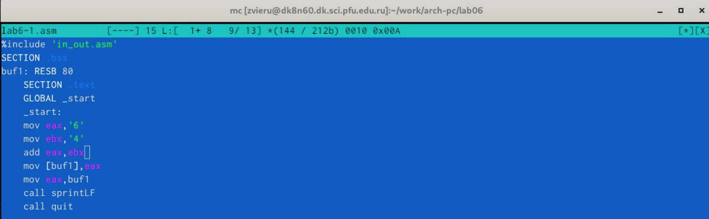{#fig:001 width=70%}

Создала исполняемый файл и запустила его (рис. [-@fig:002]).

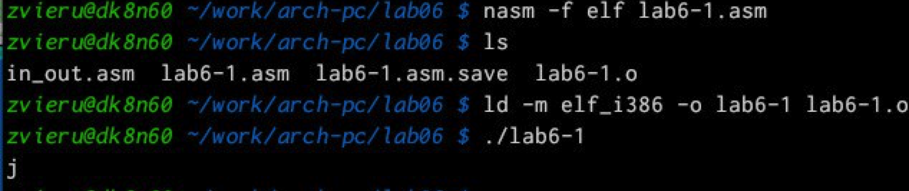{#fig:002 width=70%}

Далее изменила текст программы и вместо символов, запишем в регистры числа. То есть вместе ,'6' и ,'4' я записала 6 и 4  (рис. [-@fig:003]).

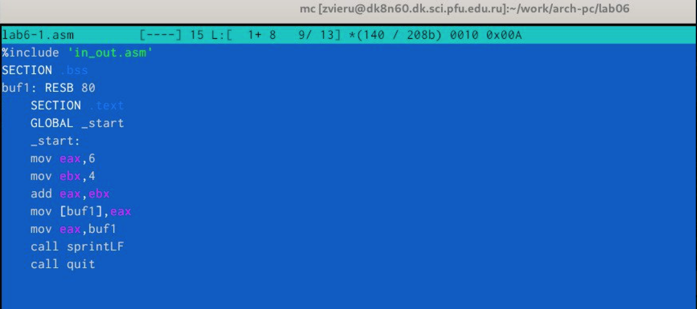{#fig:003 width=70%}

Создала исполняемый файл и запустила его (рис. [-@fig:004]).

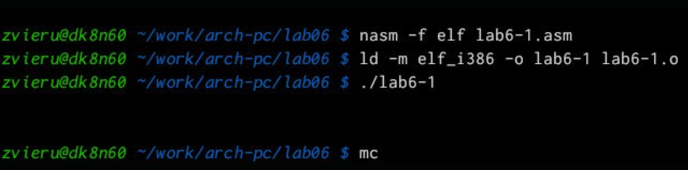{#fig:004 width=70%}

Создала файл lab6-2.asm в каталоге ~/work/arch-pc/lab06 и ввела в него следущий текст про-
граммы. (рис. [-@fig:005]).

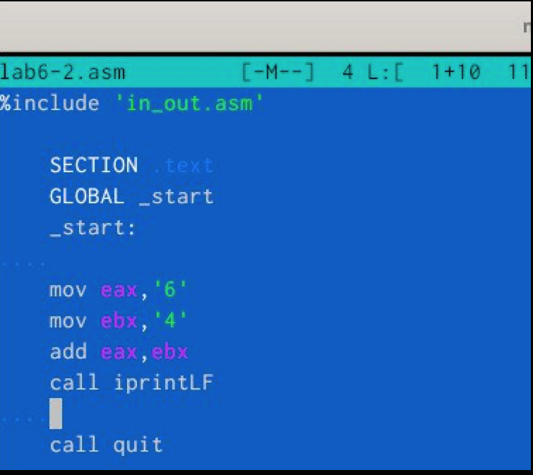{#fig:005 width=70%}

Далее изменила текст программы и вместо символов, запишем в регистры числа. То есть вместе ,'6' и ,'4' я записала 6 и 4 (рис. [-@fig:006]).

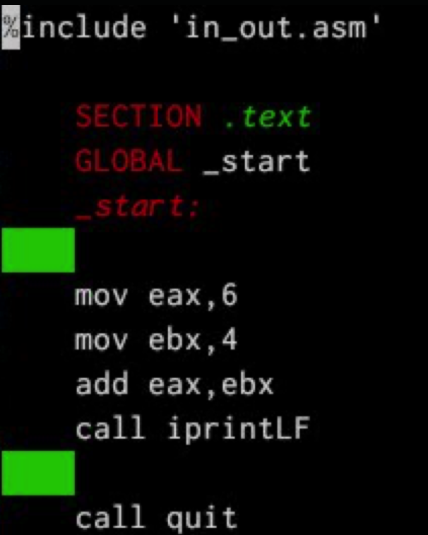{#fig:006 width=70%}

Создала исполняемый файл и запустила его (рис. [-@fig:007]).

{#fig:007 width=70%}

Поменяла iprintLF на iprint и создала исполняемый файл и запустила его (рис. [-@fig:008]).

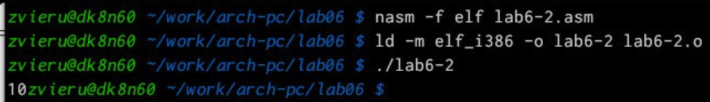{#fig:008 width=70%}

Создала файл lab6-3.asm в каталоге ~/work/arch-pc/lab06 и написала программу для вычисления выражения (рис. [-@fig:009]).

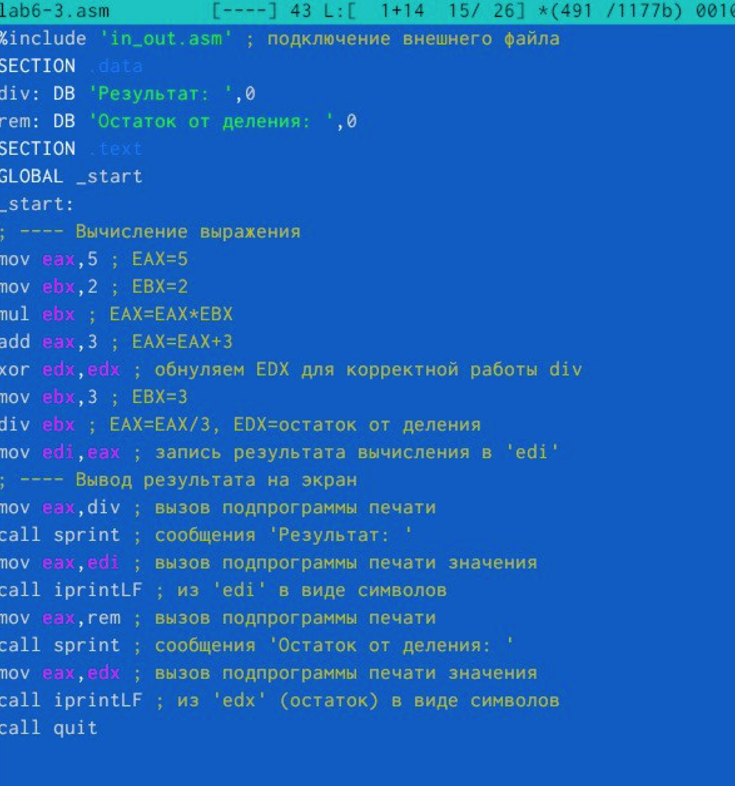{#fig:009 width=70%}

Создала исполняемый файл и запустила его (рис. [-@fig:010]).

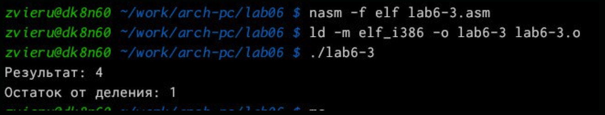{#fig:010 width=70%}

Изменила текст программы ля вычисления выражения 𝑓(𝑥) (рис. [-@fig:011]).

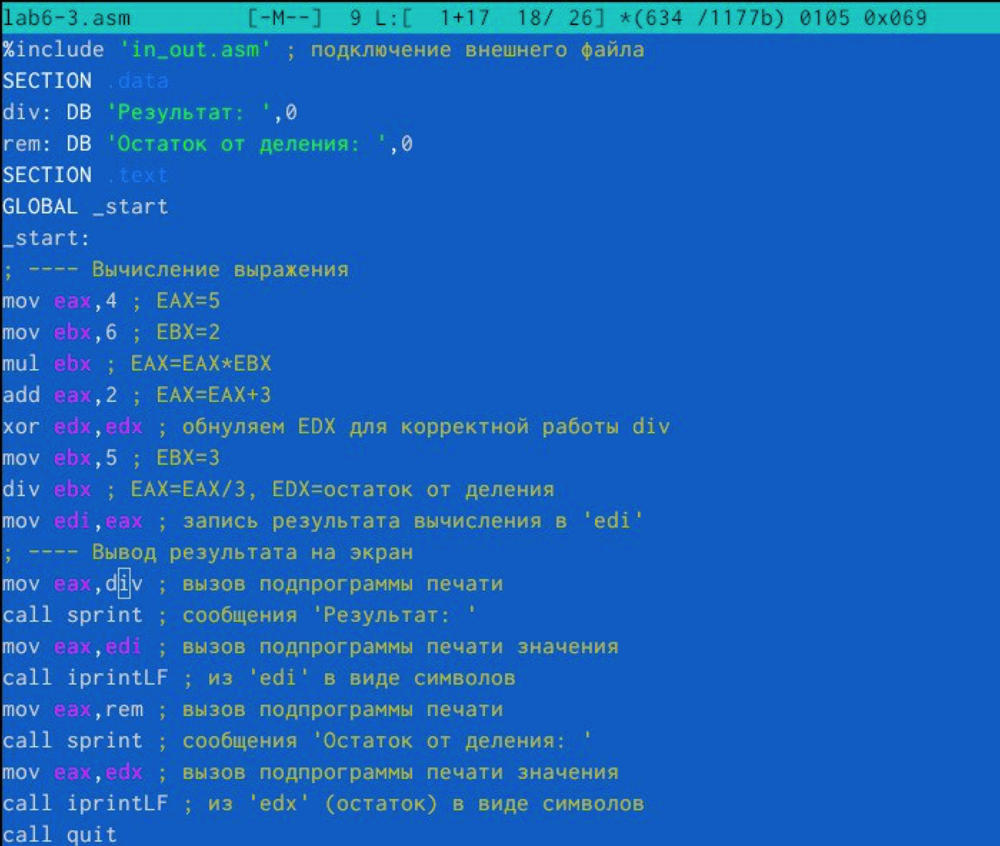{#fig:011 width=70%}

Создала исполняемый файл и запустила его (рис. [-@fig:012]).

{#fig:012 width=70%}

Создала файл variant.asm в каталоге ~/work/arch-pc/lab06 и написала программу вычисления варианта задания по номеру студенческого билета : (рис. [-@fig:013]).

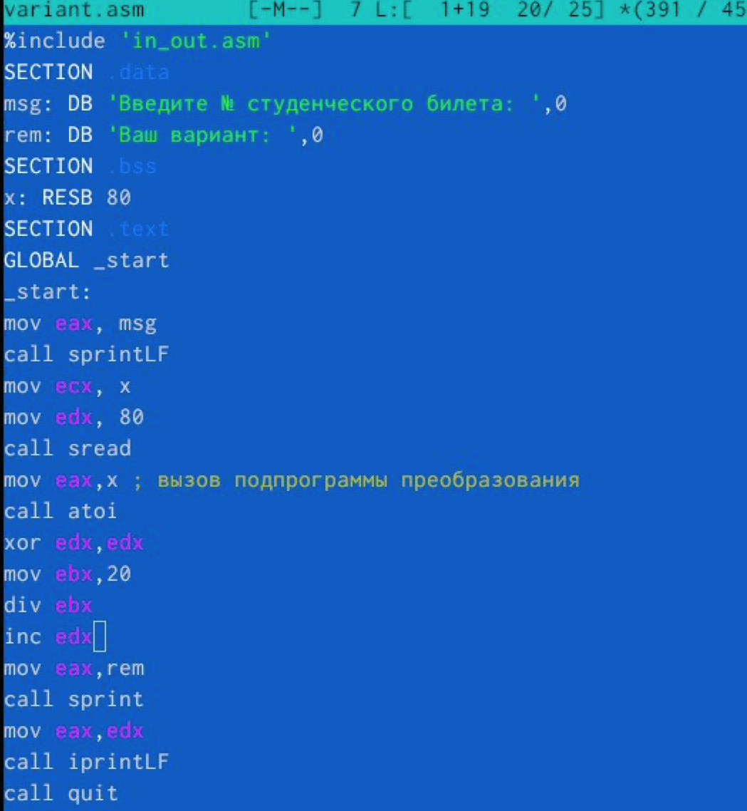{#fig:013 width=70%}

Создала исполняемый файл и запустила его (рис. [-@fig:014]).

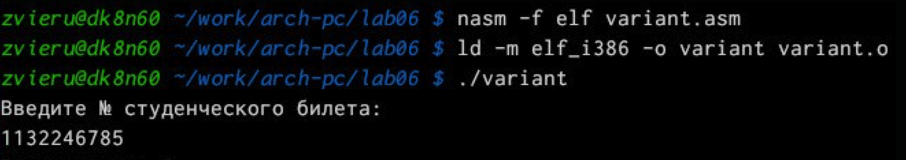{#fig:014 width=70%}

# Ответы на вопросы

1 Какие строки листинга 6.4 отвечают за вывод на экран сообщения ‘Ваш вариант:’? mov eax,msg call sprintLF
2 Для чего используется следующие инструкции?Эти инструкции используются для ввода переменной Х с клавиатуры и сохранения введенных данных.
3 Для чего используется инструкция “call atoi”?Эта инструкция используется для преобразования Кода переменной ASCII в число.
4 Какие строки листинга 6.4 отвечают за вычисления варианта? mov ebx,20 div ebx inc edx
5 В какой регистр записывается остаток от деления при выполнении инструкции “div
ebx”? В регистре ebx
6 ля чего используется инструкция “inc edx”?Для увеличения значения edx на 1.
7 акие строки листинга 6.4 отвечают за вывод на экран результата вычислений? mov eax,edx call iprintLF

# Самостоятельная работа

Создала файл lab6-0.asm в каталоге ~/work/arch-pc/lab06 и написала программу вычисления выражения f(x) (рис. [-@fig:015]).

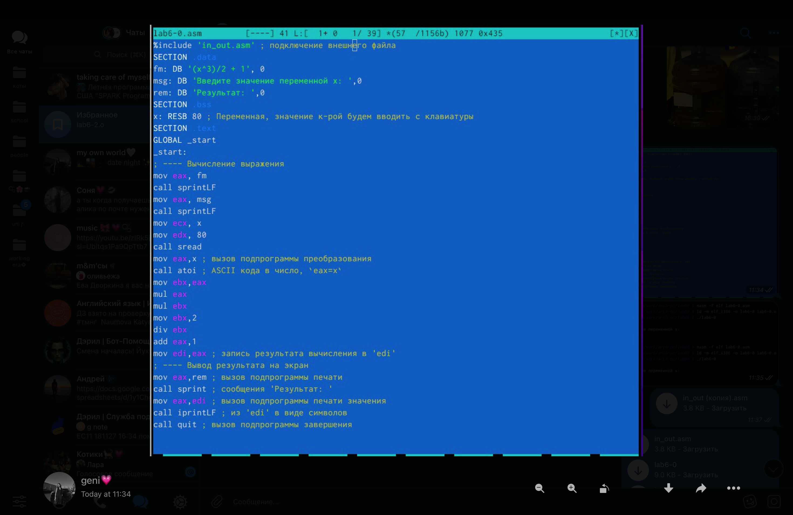{#fig:015 width=70%}

Создала исполняемый файл, запустила его и проверила если программы работает (рис. [-@fig:016]).

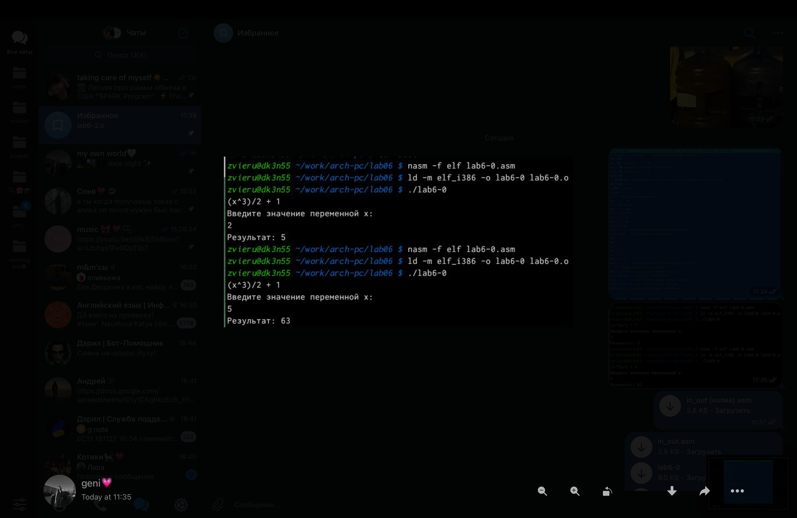{#fig:016 width=70%}

# Выводы
Выполнив данную лабораторную работу я обрела теоретические и практические знания в NASM. Я научилась выполнять самые разные арифметические операции

