---
## Front matter
title: "Лабораторная работа №7"
subtitle: "Команды безусловного и условного переходов в Nasm. Программирование ветвлений."
author: "Виеру Женифер"

## Generic otions
lang: ru-RU
toc-title: "Содержание"

## Bibliography
bibliography: bib/cite.bib
csl: pandoc/csl/gost-r-7-0-5-2008-numeric.csl

## Pdf output format
toc: true # Table of contents
toc-depth: 2
fontsize: 12pt
linestretch: 1.5
papersize: a4
documentclass: scrreprt
## I18n polyglossia
polyglossia-lang:
  name: russian
  options:
	- spelling=modern
	- babelshorthands=true
polyglossia-otherlangs:
  name: english
## I18n babel
babel-lang: russian
babel-otherlangs: english
## Fonts
mainfont: IBM Plex Serif
romanfont: IBM Plex Serif
sansfont: IBM Plex Sans
monofont: IBM Plex Mono
mathfont: STIX Two Math
mainfontoptions: Ligatures=Common,Ligatures=TeX,Scale=0.94
romanfontoptions: Ligatures=Common,Ligatures=TeX,Scale=0.94
sansfontoptions: Ligatures=Common,Ligatures=TeX,Scale=MatchLowercase,Scale=0.94
monofontoptions: Scale=MatchLowercase,Scale=0.94,FakeStretch=0.9
mathfontoptions:
## Biblatex
biblatex: true
biblio-style: "gost-numeric"
biblatexoptions:
  - parentracker=true
  - backend=biber
  - hyperref=auto
  - language=auto
  - autolang=other*
  - citestyle=gost-numeric
## Pandoc-crossref LaTeX customization
figureTitle: "Рис."
tableTitle: "Таблица"
listingTitle: "Листинг"
## Misc options
indent: true
header-includes:
  - \usepackage{indentfirst}
  - \usepackage{float} # keep figures where there are in the text
  - \floatplacement{figure}{H} # keep figures where there are in the text
---

# Цель работы

Целью работы является изучение команд условного и безусловного переходох, приобретение навыков написания программ с использованием переходов и знакомство с назначением и структурой файла листинга.

# Выполнение лабораторной работы

Создала каталог для программам лабораторной работы № 7, перешла в него и
создала файл lab6-1.asm. (рис. [-@fig:001]).

{#fig:001 width=70%}

Потом открыла его в mc и написала пример программы для использования инструкции jmp (рис. [-@fig:002]).

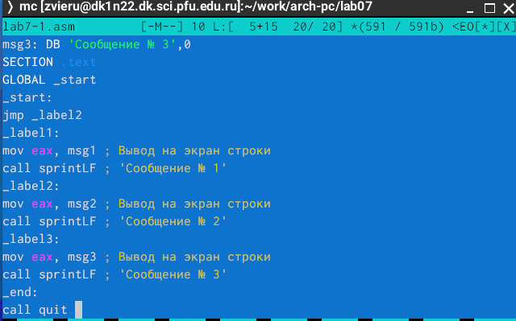{#fig:002 width=70%}

Создала исполняемый файл и запустила его (рис. [-@fig:003]).

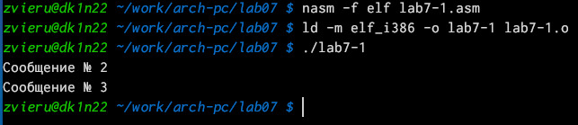{#fig:003 width=70%}

Потом измению текст программу таким образом, чтобы она выводила сначала ‘Сообщение № 2’, потом ‘Сообщение № 1’ и завершала работу (рис. [-@fig:004]).

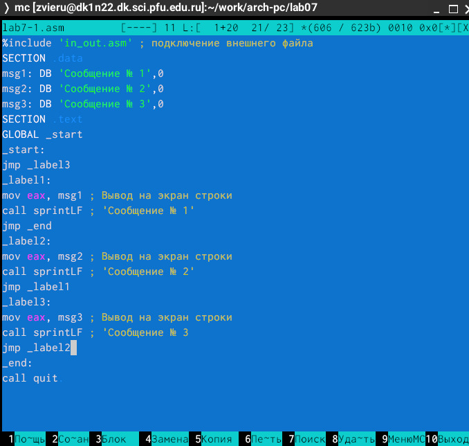{#fig:004 width=70%}

Создала исполняемый файл и запустила его (рис. [-@fig:005]).

{#fig:005 width=70%}

Потом создала файл lab7-1.asm и открыло его и написала программу которая выбирает наибольщее число из 3-х (рис. [-@fig:006]).

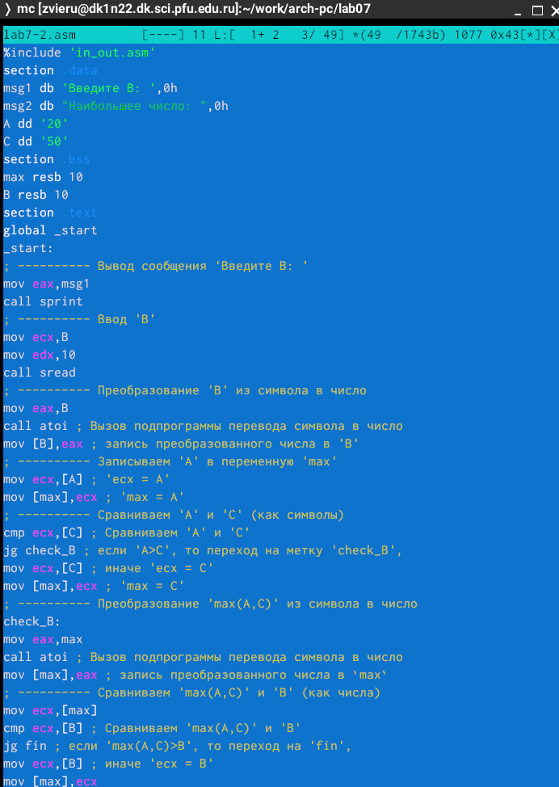{#fig:006 width=70%}

Создала исполняемый файл и запустила его (рис. [-@fig:007]).

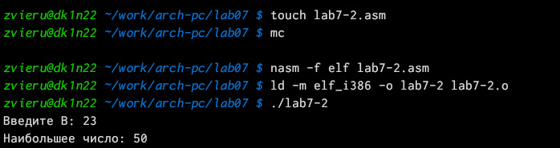{#fig:007 width=70%}

Создала файл листинга для программы из файла lab7-2.asm и открыла файл листинга lab7-2.lst с помощью любого текстового редактора, например mcedit. Объеснение одной строки: Эта строка находится на 21 месте, ее адрес "00000101", Машинный код - B8
[0000000], a mov eax,B - исходный текст программы, означающий что в
регистр еах мы вносим значения переменной В.(рис. [-@fig:008]).

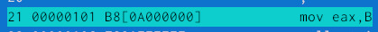{#fig:008 width=70%}

Объеснение другой строки:Эта строка находится на 35 месте, ее адрес "00000135",
*, Машинный код - E862FFFFFF, a call atoi - исходный текст программы, означающий что символ лежащий в строке выше переводится в число.(рис. [-@fig:009]).

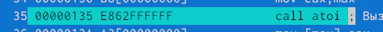{#fig:009 width=70%}

Объеснение другой строки:Эта строка находится на 47 месте, ее адрес "00000163", Машинный код - A1[00000000], a mov eax,[max] - исходный текст программы, означающий
что число хранившееся в переменной тах записывается в регистр еах. (рис. [-@fig:010]).

{#fig:010 width=70%}

Открыла файл с программой lab7-2.asm и в любой инструкции с двумя операндами
удалила один операнд.(рис. [-@fig:011]).

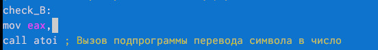{#fig:011 width=70%}

Выполнила трансляцию с получением файла листинга (рис. [-@fig:012]).

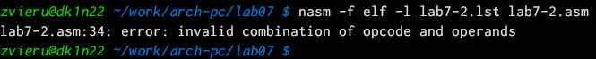{#fig:012 width=70%}

Зметим что в самой программе написано чтотшибка  (рис. [-@fig:013]).

{#fig:013 width=70%}

# Самостоятельная работа

Написала программу нахождения наименьшей из 3 целочисленных переменных (рис. [-@fig:015]).

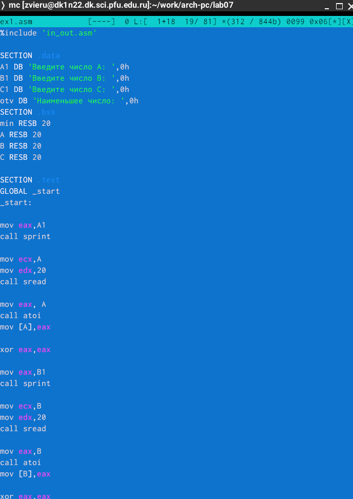{#fig:015 width=70%}

Создала исполняемый файл, запустила его и проверила если программы работает (рис. [-@fig:016]).

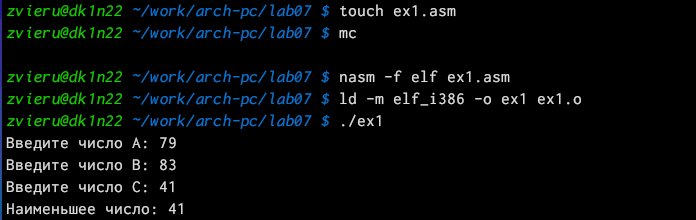{#fig:016 width=70%}

# Выводы
Выполнив данную лабораторную работу я обрела теоретические и практические знания в NASM. Я научилась использовать команд условного и безусловного переходов,написать
программ с использованием переходов и ознакомилась с назначением и структурой файла
листинга.

