---
## Front matter
title: "Лабораторная работа №8"
subtitle: "рограммирование цикла. Обработка аргументов командной строки."
author: "Виеру Женифер"

## Generic otions
lang: ru-RU
toc-title: "Содержание"

## Bibliography
bibliography: bib/cite.bib
csl: pandoc/csl/gost-r-7-0-5-2008-numeric.csl

## Pdf output format
toc: true # Table of contents
toc-depth: 2
fontsize: 12pt
linestretch: 1.5
papersize: a4
documentclass: scrreprt
## I18n polyglossia
polyglossia-lang:
  name: russian
  options:
	- spelling=modern
	- babelshorthands=true
polyglossia-otherlangs:
  name: english
## I18n babel
babel-lang: russian
babel-otherlangs: english
## Fonts
mainfont: IBM Plex Serif
romanfont: IBM Plex Serif
sansfont: IBM Plex Sans
monofont: IBM Plex Mono
mathfont: STIX Two Math
mainfontoptions: Ligatures=Common,Ligatures=TeX,Scale=0.94
romanfontoptions: Ligatures=Common,Ligatures=TeX,Scale=0.94
sansfontoptions: Ligatures=Common,Ligatures=TeX,Scale=MatchLowercase,Scale=0.94
monofontoptions: Scale=MatchLowercase,Scale=0.94,FakeStretch=0.9
mathfontoptions:
## Biblatex
biblatex: true
biblio-style: "gost-numeric"
biblatexoptions:
  - parentracker=true
  - backend=biber
  - hyperref=auto
  - language=auto
  - autolang=other*
  - citestyle=gost-numeric
## Pandoc-crossref LaTeX customization
figureTitle: "Рис."
tableTitle: "Таблица"
listingTitle: "Листинг"
## Misc options
indent: true
header-includes:
  - \usepackage{indentfirst}
  - \usepackage{float} # keep figures where there are in the text
  - \floatplacement{figure}{H} # keep figures where there are in the text
---

# Цель работы

Целью работы является приобретение навыков написания программ с использованием циклов и обработкой аргументов командной строки..

# Выполнение лабораторной работы

Создала каталог для программам лабораторной работы № 8, перешла в него и
создала файл lab8-1.asm. Потом открыла его с помощью команды mc и горячай клавиши F4 и написала в нем следующий текст(рис. [-@fig:001]).

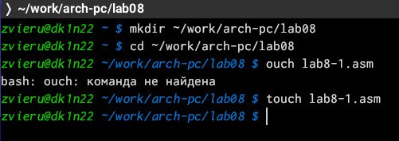{#fig:001 width=70%}

В lab8-1.asm написала программу вывода значений регистра ecx (рис. [-@fig:002]).

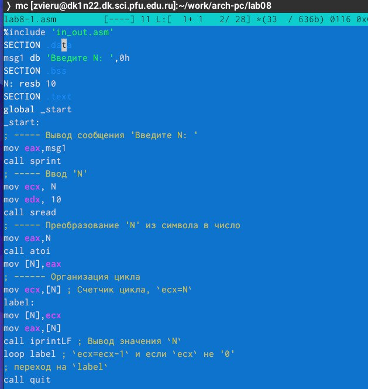{#fig:002 width=70%}

Создала исполняемый файл запустила его и проверила его работу  (рис. [-@fig:003]).

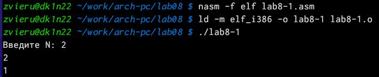{#fig:003 width=70%}

Изменила текст программы добавив изменение значение регистра ecx в цикле: (рис. [-@fig:004]).

{#fig:004 width=70%}

Создала исполняемый файл запустила его и проверила его работу (рис. [-@fig:005]).

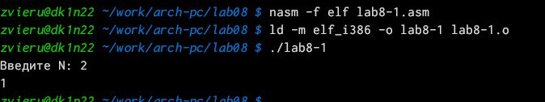{#fig:005 width=70%}

Внесила изменения в текст программы добавив команды push и pop (добавления в стек и извлечения из стека) для сохранения значения счетчика цикла
loop: (рис. [-@fig:006]).

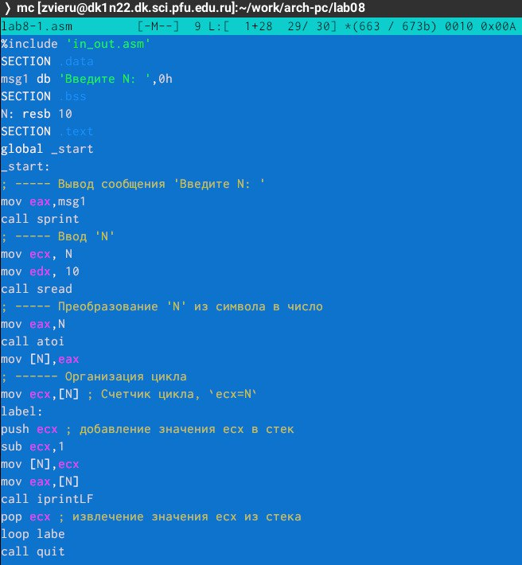{#fig:006 width=70%}

Создала исполняемый файл и запустила его и по итоге число проходко циклов стало соответствовать числу введеному с клавиатуры (рис. [-@fig:007]).

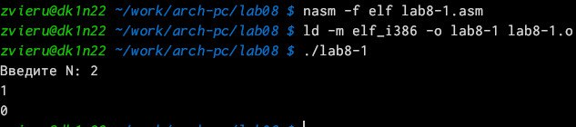{#fig:007 width=70%}

Создала lab8-2.asm и написала программу выводящую на экран аргументы командной строки(рис. [-@fig:008]).

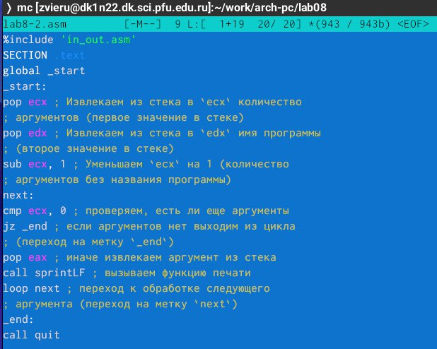{#fig:008 width=70%}

Создала исполняемый файл и запустила его и проверила его работу вводя /lab8-2 аргумент1 аргумент 2 'аргумент 3(рис. [-@fig:009]).

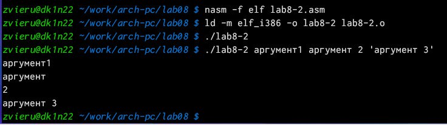{#fig:009 width=70%}

Создала lab8-3.asm и написала программу вычисления суммы аргументов командной строки(рис. [-@fig:010]).

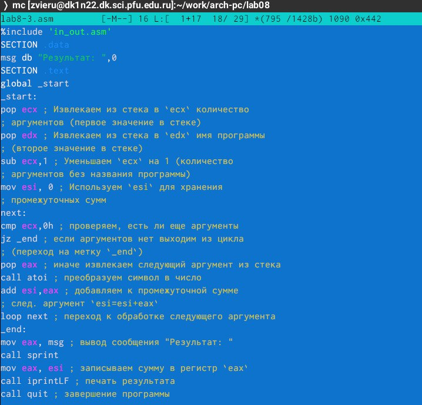{#fig:010 width=70%}

Создала исполняемый файл и запустила его и проверила его работу вводя /lab8-3 12 13 7 10 5 (рис. [-@fig:011]).

{#fig:011 width=70%}

Изменила текст программы для вычисления произведения аргументов командной строки. (рис. [-@fig:012]).

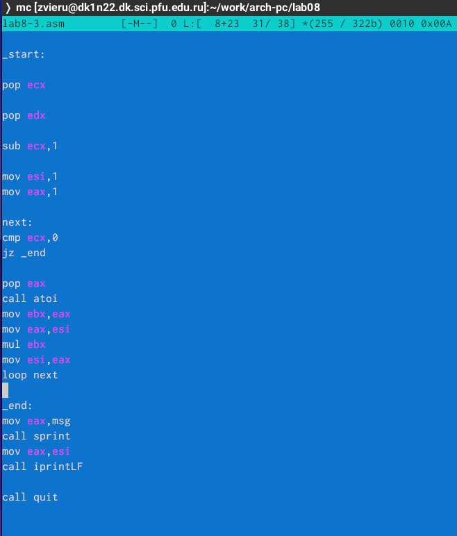{#fig:012 width=70%}

Создала исполняемый файл и запустила его и проверила его работу вводя /lab8-3 1 2 3  (рис. [-@fig:013]).

{#fig:013 width=70%}

# Самостоятельная работа

Создала файл lab8-4.asm в каталоге ~/work/arch-pc/lab06 и написала программу которая находит сумму значений функции f(x) (рис. [-@fig:014]).

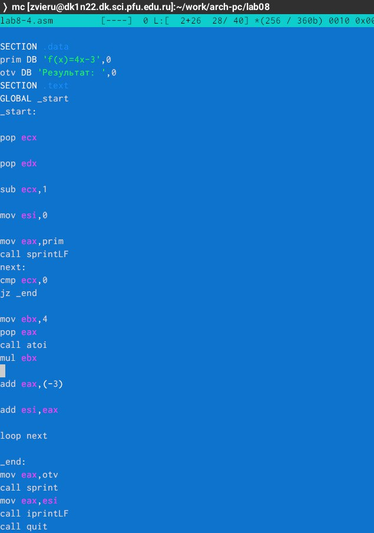{#fig:014 width=70%}

Создала исполняемый файл, запустила его и проверила если программы работает (рис. [-@fig:015]).

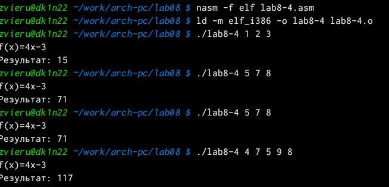{#fig:015 width=70%}

# Выводы
Выполнив данную лабораторную работу я обрела теоретические и практические знания в  организации стека, добавлении элемента в стеке, извлечении элемента из стеке и в организации циклов

