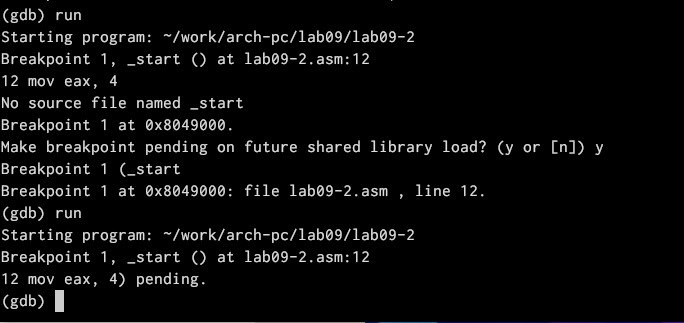
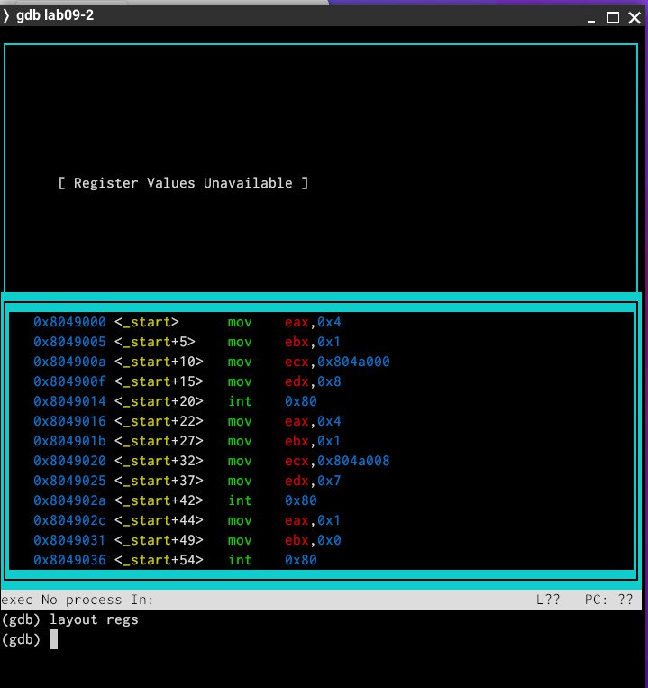

---
## Front matter
title: "Лабораторная работа №9"
subtitle: "Понятие подпрограммы.Отладчик GDB."
author: "Виеру Женифер"

## Generic otions
lang: ru-RU
toc-title: "Содержание"

## Bibliography
bibliography: bib/cite.bib
csl: pandoc/csl/gost-r-7-0-5-2008-numeric.csl

## Pdf output format
toc: true # Table of contents
toc-depth: 2
fontsize: 12pt
linestretch: 1.5
papersize: a4
documentclass: scrreprt
## I18n polyglossia
polyglossia-lang:
  name: russian
  options:
	- spelling=modern
	- babelshorthands=true
polyglossia-otherlangs:
  name: english
## I18n babel
babel-lang: russian
babel-otherlangs: english
## Fonts
mainfont: IBM Plex Serif
romanfont: IBM Plex Serif
sansfont: IBM Plex Sans
monofont: IBM Plex Mono
mathfont: STIX Two Math
mainfontoptions: Ligatures=Common,Ligatures=TeX,Scale=0.94
romanfontoptions: Ligatures=Common,Ligatures=TeX,Scale=0.94
sansfontoptions: Ligatures=Common,Ligatures=TeX,Scale=MatchLowercase,Scale=0.94
monofontoptions: Scale=MatchLowercase,Scale=0.94,FakeStretch=0.9
mathfontoptions:
## Biblatex
biblatex: true
biblio-style: "gost-numeric"
biblatexoptions:
  - parentracker=true
  - backend=biber
  - hyperref=auto
  - language=auto
  - autolang=other*
  - citestyle=gost-numeric
## Pandoc-crossref LaTeX customization
figureTitle: "Рис."
tableTitle: "Таблица"
listingTitle: "Листинг"
## Misc options
indent: true
header-includes:
  - \usepackage{indentfirst}
  - \usepackage{float} # keep figures where there are in the text
  - \floatplacement{figure}{H} # keep figures where there are in the text
---

# Цель работы

Целью работы является приобретение навыков написания программ с использованием циклов и обработкой аргументов командной строки..

# Выполнение лабораторной работы

Создала каталог для программам лабораторной работы № 9, перешла в него и
создала файл lab09-1.asm. Потом открыла его с помощью команды mc и горячай клавиши F4 и написала в нем следующий текст(рис. [-@fig:001]).

{#fig:001 width=70%}

Потом написала программу программу вычисления арифметического выражения
f(x) = 2x + 7 с помощью подпрограммы _calcul.  (рис. [-@fig:002]).

{#fig:002 width=70%}

Создала исполняемый файл запустила его и проверила его работу  (рис. [-@fig:003]).

{#fig:003 width=70%}

Изменила текст программы так, чтобы она вычисляла f(g(x)) (рис. [-@fig:004]).

{#fig:004 width=70%}

Создала исполняемый файл запустила его и проверила его работу (рис. [-@fig:005]).

{#fig:005 width=70%}

Создала файл lab09-2.asm с текстом программы вывода сообщения Hello world!(рис. [-@fig:006]).

{#fig:006 width=70%}

Создала исполняемый файл и загрузила его файл в отладчик gdb и запустила его(рис. [-@fig:007]).

{#fig:007 width=70%}

Для более подробного анализа программы установила брейкпоинт на метку _start, с
которой начинается выполнение любой ассемблерной программы, и запустила её(рис. [-@fig:008]).

{#fig:008 width=70%}

Посмотрела дисассимилированный код программы с помощью команды disassemble
начиная с метки _start(рис. [-@fig:009]).

{#fig:009 width=70%}

Переключилась на отображение команд с Intel’овским синтаксисом, введя команду set
disassembly-flavor intel(рис. [-@fig:010]).

{#fig:010 width=70%}

Включила режим псевдографики для более удобного анализа программы  (рис. [-@fig:011]).

{#fig:011 width=70%}

Проверила установления точки останова по имени метки (_start) с помощью команды info breakpoints  (рис. [-@fig:012]).

{#fig:012 width=70%}

С помощью команды я посмотрела значение переменной msg1 и msg2(рис. [-@fig:013]).

{#fig:013 width=70%}

С помощью команды set изменила значение переменной msg1 (рис. [-@fig:014]).

{#fig:014 width=70%}

С помощью команды set изменила значение переменной msg2 (рис. [-@fig:015]).

{#fig:015 width=70%}

Потом я вывела значение регистров ecx eax  (рис. [-@fig:016]).

{#fig:016 width=70%}

Я изменила значение регистра ebx. Команда выводит два разных значения
так как в первый раз мы вносим значение 2, а во второй раз регистр равен
двум, поэтому и значения разные.  (рис. [-@fig:017]).

{#fig:017 width=70%}

Я посмотрела все позиции стека. По первому адрему хранится адрес,
в остальных адресах хранятся элементы. Элементы расположены с
интервалом в 4 единицы, так как стек может хранить до 4 байт, и для того  (рис. [-@fig:018]).

{#fig:018 width=70%}

# Выводы
Выполнив данную лабораторную работу я приобрела навыки написания программ использованием подпрограмм. Познакомилася с методами отладки при помозь GDB и его основными возможностями.

