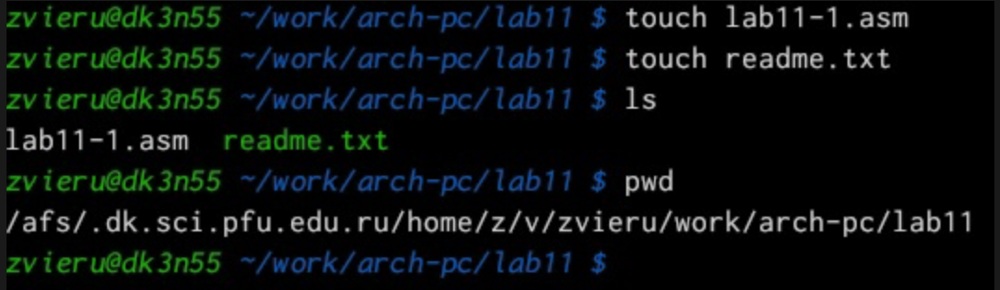
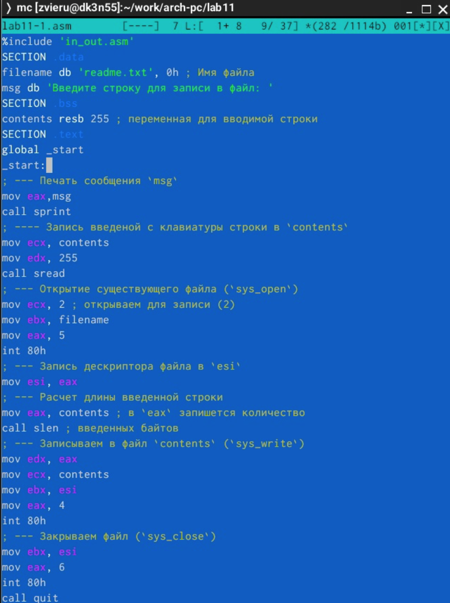
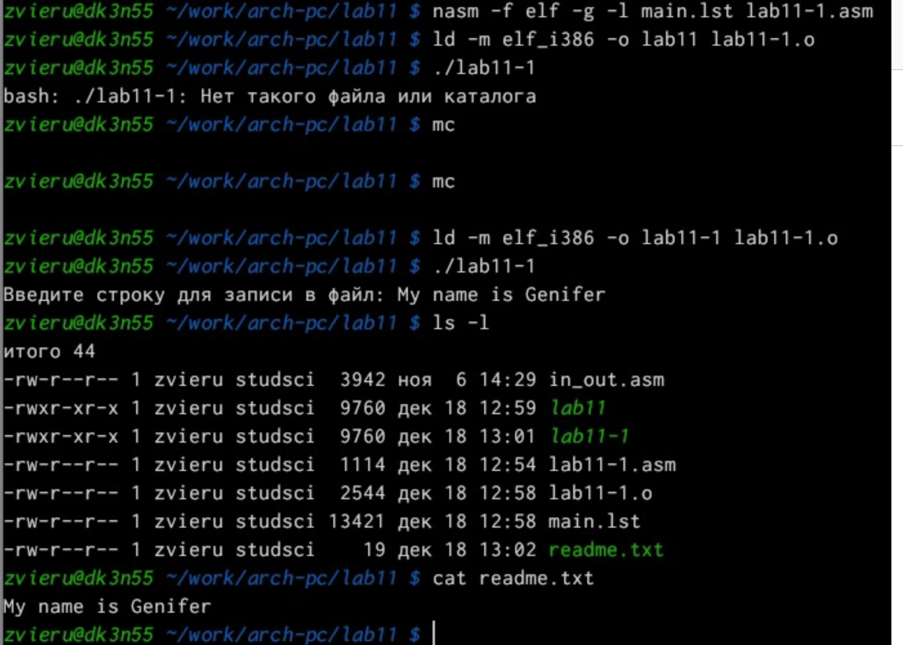
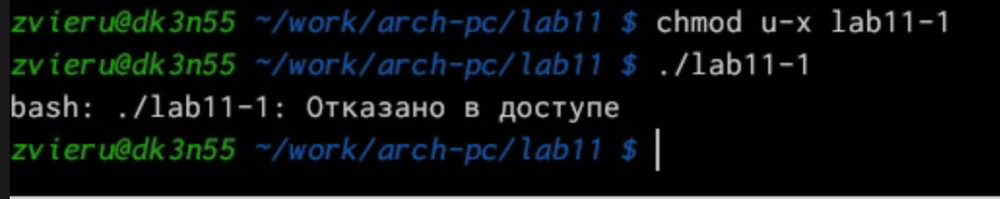
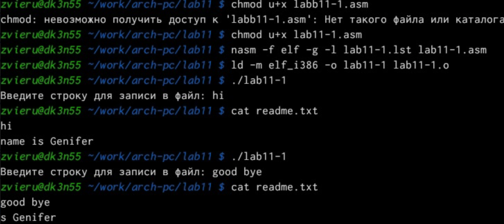
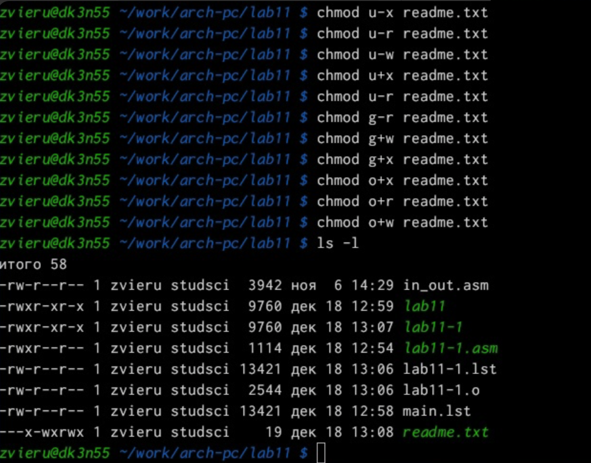
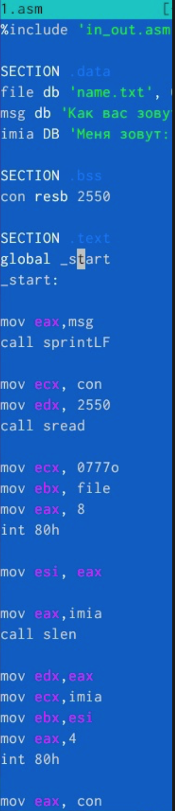
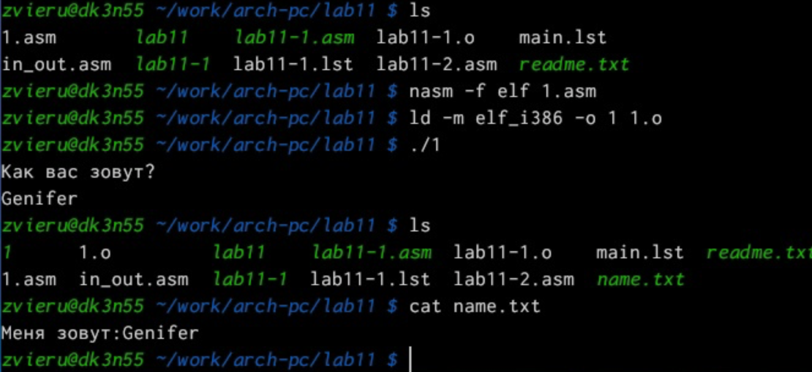

---
## Front matter
title: "Лабораторная работа №10"
subtitle: "абота с файлами cредствами Nasm"
author: "Виеру Женифер"

## Generic otions
lang: ru-RU
toc-title: "Содержание"

## Bibliography
bibliography: bib/cite.bib
csl: pandoc/csl/gost-r-7-0-5-2008-numeric.csl

## Pdf output format
toc: true # Table of contents
toc-depth: 2
fontsize: 12pt
linestretch: 1.5
papersize: a4
documentclass: scrreprt
## I18n polyglossia
polyglossia-lang:
  name: russian
  options:
	- spelling=modern
	- babelshorthands=true
polyglossia-otherlangs:
  name: english
## I18n babel
babel-lang: russian
babel-otherlangs: english
## Fonts
mainfont: IBM Plex Serif
romanfont: IBM Plex Serif
sansfont: IBM Plex Sans
monofont: IBM Plex Mono
mathfont: STIX Two Math
mainfontoptions: Ligatures=Common,Ligatures=TeX,Scale=0.94
romanfontoptions: Ligatures=Common,Ligatures=TeX,Scale=0.94
sansfontoptions: Ligatures=Common,Ligatures=TeX,Scale=MatchLowercase,Scale=0.94
monofontoptions: Scale=MatchLowercase,Scale=0.94,FakeStretch=0.9
mathfontoptions:
## Biblatex
biblatex: true
biblio-style: "gost-numeric"
biblatexoptions:
  - parentracker=true
  - backend=biber
  - hyperref=auto
  - language=auto
  - autolang=other*
  - citestyle=gost-numeric
## Pandoc-crossref LaTeX customization
figureTitle: "Рис."
tableTitle: "Таблица"
listingTitle: "Листинг"
## Misc options
indent: true
header-includes:
  - \usepackage{indentfirst}
  - \usepackage{float} # keep figures where there are in the text
  - \floatplacement{figure}{H} # keep figures where there are in the text
---

# Цель работы

Целью работы является приобретение навыков написания программ для работы с файлами

# Выполнение лабораторной работы

Я создала каталог lab11 и в нем файл lab11.asm(рис. [-@fig:001]).

{#fig:001 width=70%}

Я ввела в файл текст программы и запустил ее. Ответ сохранился в файле
readme.txt.  (рис. [-@fig:002]).

{#fig:002 width=70%}

Создала исполняемый файл запустила его и проверила его работу  (рис. [-@fig:003]).

{#fig:003 width=70%}

С помощью команды сhmod я запретила выполнять программу. Выдало отказ
в доступе, как и следовало ожидать, так как я просто запретила запускать
программу для владельца, то есть для себя. (рис. [-@fig:004]).

{#fig:004 width=70%}

С помощью команды я дала разрешение на исполнение файлу с исходным
текстом и перекомпелировал программу, она заработала, так как файл был
со всеми разрешениями и до этого я запретила выполняться уже готовой
программе, а это фактически новая программа которая обладает другими
разрешениями, поэтому они и запустилась. (рис. [-@fig:005]).

{#fig:005 width=70%}

Я предоставила определенные права файлу readme.txt в соответствие с
вариантом 1.(рис. [-@fig:006]).

{#fig:006 width=70%}

# Выполнение самостоятельной работы

Я написала программу, которая запрашивает имя и выводит его в созданном
файле. Файл создает сама программа. (рис. [-@fig:007]).

{#fig:007 width=70%}

{#fig:008 width=70%}

# Выводы
Выполнив данную лабораторную работу я приобрела навыки написания программ для работы с файлами.

